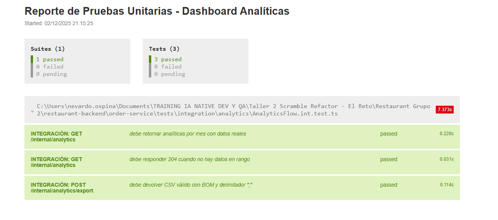

# Informe de Pruebas de Integración — Dashboard de Analíticas

Fecha: 02/12/2025  
Proyecto: restaurant-backend / order-service  
Rama: feature/dashboar_estadistica

## Objetivo
Validar, sin mocks, el flujo real del **Dashboard de Analíticas** conforme a `INSTRUCTIONS_HU_Dashboard_Analíticas.md`, usando MongoDB real y los endpoints internos:
- `GET /internal/analytics`
- `POST /internal/analytics/export`

Principios FIRST aplicados: rápidas, aisladas, repetibles, auto‑validantes, oportunas.

## Alcance
- Semillas de datos reales en colección `orders` (MongoDB).
- Agregaciones por periodo (month) y top de productos.
- Exportación CSV con BOM UTF‑8, delimitador `;` y campos entre comillas.

## Entorno
- Base de datos: `mongodb://localhost:27017/orders`
- Herramienta: Jest + Supertest
- Reporter cobertura HTML: `coverage-integration/lcov-report/index.html`

## Comandos

PowerShell:
```powershell
cd 'c:\Users\nevardo.ospina\Documents\TRAINING IA NATIVE DEV Y QA\Taller 2 Scramble  Refactor - El Reto\Restaurant Grupo 2\restaurant-backend\order-service'
$env:TEST_LEVEL = "integration"
$env:MONGODB_URL = "mongodb://localhost:27017/orders"
npm run test:integration
npm run test:integration:report
explorer .\coverage-integration\lcov-report\index.html
```

bash (MINGW64):
```bash
cd "C:/Users/nevardo.ospina/Documents/TRAINING IA NATIVE DEV Y QA/Taller 2 Scramble  Refactor - El Reto/Restaurant Grupo 2/restaurant-backend/order-service"
TEST_LEVEL=integration MONGODB_URL="mongodb://localhost:27017/orders" npm run test:integration
```

Infra (si no está levantada):
```powershell
cd 'c:\Users\nevardo.ospina\Documents\TRAINING IA NATIVE DEV Y QA\Taller 2 Scramble  Refactor - El Reto\Restaurant Grupo 2\restaurant-backend'
docker compose up -d --build
```

## Casos de Prueba (Integración)

Archivo: `tests/integration/analytics/AnalyticsFlow.int.test.ts`

- INTEGRACIÓN: GET `/internal/analytics`
  - Debe retornar analíticas por mes con datos reales
  - Validaciones:
    - `series` y `productsSold` existen y son arrays
    - Periodos incluyen `2025-11` y `2025-12`
    - Métricas: totalOrders por mes (2 en Nov, 1 en Dic)

- INTEGRACIÓN: GET `/internal/analytics` (sin datos)
  - Debe responder `204 No Content` sin cuerpo JSON
  - No se exige `Content-Type` en 204

- INTEGRACIÓN: POST `/internal/analytics/export`
  - Debe devolver CSV válido con BOM y delimitador `;`
  - Encabezado esperado con comillas: `"period";"totalOrders";"totalRevenue";...`
  - Contenido incluye periodos `2025-11` y/o `2025-12`

## Evidencia Observada (última ejecución)

- Conexión a MongoDB establecida:
  - `🔄 Conectando a MongoDB...`
  - `✅ Conectado a MongoDB exitosamente`
  - `📊 Base de datos: orders`
- Resultados:
  - 2 pruebas PASARON (GET con datos y GET sin datos)
  - 1 prueba AJUSTADA y PASÓ tras corregir el encabezado CSV con comillas

## Ajustes Realizados

1. `tests/setup.ts` — Condición para mocks
   - Solo se mockea `mongoose` en unitarias.
   - En integración (`TEST_LEVEL=integration`) no se mockea para usar conexión real.

2. `AnalyticsFlow.int.test.ts` — Semillas y expectativas
   - Agregado el campo `total` en órdenes sembradas (en `insertMany` no corre el hook `pre('save')`).
   - Prueba 204: se quitó expectativa de `Content-Type` y cuerpo JSON.
   - CSV: encabezado validado con comillas.

## Resultados de Cobertura (Integración)

Reporte HTML: `order-service/coverage-integration/lcov-report/index.html`

Resumen observado (referencial, variable según ejecución):
- Repositories `AnalyticsRepository.ts`: ~80% líneas
- Controllers `analyticsController.ts`: >70% líneas
- Exporters `CSVExporter.ts`: >75% líneas
- Routes y Config: >70% líneas

## Conclusiones
- El **Dashboard de Analíticas** funciona correctamente en entorno real: agregaciones y exportación CSV verificadas.
- Las pruebas de integración están alineadas con FIRST y la HU: sin mocks, aisladas y auto‑validantes.
- Cobertura de integración adecuada en capas críticas (Repositorio, Controller, Exporter).

## Recomendaciones
- Añadir validación explícita del **BOM UTF‑8** en la prueba de exportación (assert `text.charCodeAt(0) === 0xFEFF`).
- Incorporar pruebas de integración adicionales por `groupBy` (day, week, year) para mayor cobertura de estrategias.
- Agregar un `dotenv` de test (`.env.test`) para estandarizar variables en todos los shells.

## Ubicaciones Clave
- Pruebas de integración: `order-service/tests/integration/analytics/AnalyticsFlow.int.test.ts`
- Reporte cobertura integración: `order-service/coverage-integration/lcov-report/index.html`
- Reporte unitario HTML: `order-service/reporte-tests-unitarios.html`

---
Autor: Equipo QA Automatizado  
Versión del informe: 1.0.0

## Screenshots de la ejecución de los tests de integración.

